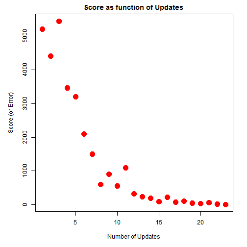

## Match Five Numbers Shiny App

Introduction: 
This app utilizes Shiny and is written in R.  The user guesses (calculates) five numbers from 1 to 99.  The only hint offered to the user is the error =  sum of the differences (computer's number minus user's number) squared.  This score is plotted vs. updates as shown:

Code Chunk #1, Score Plot
 

--- .class #id 

## Running the App

The app uses five sliders for obtaining input of five numbers from 1 to 99 from the user.  When the user has selected a set of five numbers, he or she can press the Update button in order to see if the error (or score) has either increased or decreased.  If the user adjusts a slider and the new number has a lower error, the number is closer to the computer's number!  On the other hand, if the new number produces a higher error, the user is moving in the wrong direction.

By probing around and guessing numbers with a bit of strategy, it is possible to get the score down to zero in about 40+ tries.  Without a strategy and just guessing, the sky's the limit.  It is mathematically possible to calculate and update to obtain a zero score in only 10 updates!

The app (ui.R and server.R code, with supporting documentation) can be found at:
               https://github.com/mm-mm/datasciencecoursera

--- .class #id 

## Tricks for Mathematicians and Hackers

A mathematical user will appreciate that the error is simply a parabola of the form y=(x-x0)^2 where x is a vector of length 5.  A simple optimization problem!  The mathematician can see the error and the change in error resulting my incrementing one of the sliders (by one), and the resulting change in error reveals the computer's number using the formula x0 = x-(deltaerror-1)/2.  (A REAL mathematician can derive this!)

Therefore, you can "guess" the computer's numbers in 2x5 = 10 iterations of the Update button. 

Are you telepathic?  Perhaps you can beat the minimum of 10?  Or perhaps you are a hacker and can set.seed in the R console and establish repeatability of "random" numbers so you can appear telepathic to unknowing friends!

--- .class #id 

##  Code Details

The app uses five sliders and one goButton.  The "number of tries" is just the output of the goButton which increments each time it is pushed.  In order to prevent the score from updating in real time when the sliders are moved, it is necessary to use isolate() inside of the renderText({}) and other output functions.

Five random numbers 1 to 99 are generated, then the score is computed from the sum of differences squared.  

In order to plot the sequence of scores resulting from the tries, it is necessary to compute the error inside of an isolate() in an render-type function, while utilizing global variables, in order to preserve x's and y's for the next updated plot.  In shiny, variables computed inside of isolate() can be made global using <<- instead of <- for assignment.  The use of global variables is critical for this particular app.

This game-like app shows how (in a guessing mode) it is possible to jump over a minimum while increasing or decreasing with too large a delta-x.  On the other hand, small changes will require many iterations before reaching the minimum for a given slider.  This is similar to the much more complicated case of machine learning gradient descent type learning rates.

